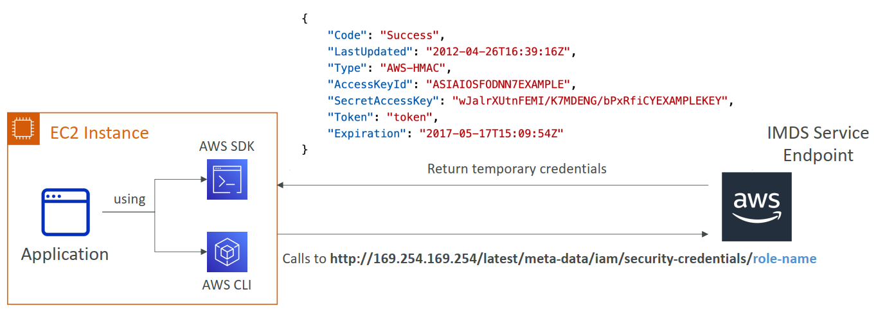
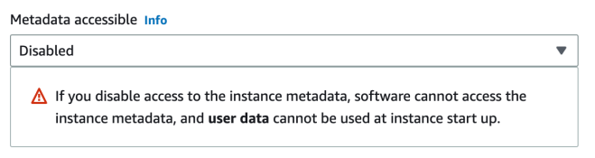

# EC2 Instance Metadata Service (IMDS)

## What is IMDS?

The Instance Metadata Service (IMDS) is a component of Amazon EC2 that provides a way for EC2 instances to access instance-specific data without explicitly using AWS credentials. IMDS is an on-instance endpoint with the IP address `169.254.169.254` that can only be accessed from within the EC2 instance itself.

IMDS offers two versions:

- **IMDSv1**: The original, request/response method
- **IMDSv2**: A more secure, session-oriented method that protects against certain types of vulnerabilities

## What is IMDS Used For?

The Instance Metadata Service provides essential information and capabilities for EC2 instances:

| Purpose                    | Description                                                                               |
| -------------------------- | ----------------------------------------------------------------------------------------- |
| **Instance Information**   | Access details like instance ID, type, IP addresses, MAC address, AMI ID, security groups |
| **IAM Role Credentials**   | Obtain temporary security credentials for attached IAM roles                              |
| **User Data**              | Retrieve configuration scripts specified at launch time                                   |
| **Dynamic Data**           | Access instance identity documents and security credentials                               |
| **Networking Information** | Details about VPC, subnet, and network configurations                                     |
| **Spot Instance Notices**  | Check if a spot instance is scheduled for termination                                     |



IMDS is extensively used by AWS services, SDKs, CLI, and customer applications to operate effectively within the AWS environment without requiring explicit credential management.

## IMDSv1 Usage Guide

IMDSv1 uses a simple request/response method that requires a single HTTP request.

### Common IMDSv1 Commands:

```bash
# Get a list of all available metadata categories:
curl http://169.254.169.254/latest/meta-data/

# Get the instance ID:
curl http://169.254.169.254/latest/meta-data/instance-id

# Get the instance type:
curl http://169.254.169.254/latest/meta-data/instance-type

# Get the public IP address:
curl http://169.254.169.254/latest/meta-data/public-ipv4

# Get the security groups:
curl http://169.254.169.254/latest/meta-data/security-groups

# Get the IAM role name:
curl http://169.254.169.254/latest/meta-data/iam/security-credentials/

# Get temporary credentials for the IAM role:
curl http://169.254.169.254/latest/meta-data/iam/security-credentials/YOUR_ROLE_NAME

# Access user data (if configured):
curl http://169.254.169.254/latest/user-data
```

### Security Concerns with IMDSv1

IMDSv1 is vulnerable to server-side request forgery (SSRF) attacks, where a malicious actor could trick an application running on the instance to make requests to the metadata service, potentially exposing sensitive information.

## IMDSv2 Usage Guide

IMDSv2 uses a session-oriented approach that requires two steps: creating a session token and then using that token in subsequent requests.

### Step 1: Create a Session Token

Create a token (valid for up to 6 hours, TTL in seconds):

```bash
TOKEN=$(curl -X PUT "http://169.254.169.254/latest/api/token" -H "X-aws-ec2-metadata-token-ttl-seconds: 21600")
```

### Step 2: Use the Token in Requests

```bash
# Get a list of all available metadata categories:
curl -H "X-aws-ec2-metadata-token: $TOKEN" http://169.254.169.254/latest/meta-data/

# Get the instance ID:
curl -H "X-aws-ec2-metadata-token: $TOKEN" http://169.254.169.254/latest/meta-data/instance-id

# Get the instance type:
curl -H "X-aws-ec2-metadata-token: $TOKEN" http://169.254.169.254/latest/meta-data/instance-type

# Get the public IP address:
curl -H "X-aws-ec2-metadata-token: $TOKEN" http://169.254.169.254/latest/meta-data/public-ipv4

# Get the security groups:
curl -H "X-aws-ec2-metadata-token: $TOKEN" http://169.254.169.254/latest/meta-data/security-groups

# Get the IAM role name:
curl -H "X-aws-ec2-metadata-token: $TOKEN" http://169.254.169.254/latest/meta-data/iam/security-credentials/

# Get temporary credentials for the IAM role:
curl -H "X-aws-ec2-metadata-token: $TOKEN" http://169.254.169.254/latest/meta-data/iam/security-credentials/YOUR_ROLE_NAME

# Access user data (if configured):
curl -H "X-aws-ec2-metadata-token: $TOKEN" http://169.254.169.254/latest/user-data
```

### Benefits of IMDSv2

1. **Increased Security**: Protects against SSRF vulnerabilities by requiring the PUT request and session token
2. **Session-based**: Tokens have a configurable TTL, limiting the time window of potential exposure
3. **HTTP Headers**: Uses standard HTTP headers which are typically restricted in web applications

## Securing IMDS

### Enforcing IMDSv2 on EC2 Instances

To ensure only IMDSv2 is used on your instances, you can:

1. Configure the `HttpTokens` parameter to `required` when launching new instances
2. Modify existing instances to require IMDSv2:

```bash
aws ec2 modify-instance-metadata-options \
  --instance-id i-1234567890abcdef0 \
  --http-tokens required \
  --http-endpoint enabled
```

> **Best Practice**: AWS recommends using IMDSv2 instead of IMDSv1 for all new applications and transitioning existing applications to IMDSv2 for enhanced security.

### Enforcing IMDSv2 at Launch Time

You can force IMDSv2 when launching new instances using:

#### AWS Console

In the EC2 launch instance wizard, under "Advanced Details", set "Metadata version" to "V2 only (token required)".

#### AWS CLI

Include the `--metadata-options` parameter with `HttpTokens=required`:

```bash
aws ec2 run-instances \
  --image-id ami-12345678 \
  --instance-type t2.micro \
  --metadata-options "HttpEndpoint=enabled,HttpTokens=required" \
  --key-name MyKeyPair
```

#### Requiring IMDSv2 when Registering an AMI

To ensure IMDSv2 is required for instances launched from an AMI:

```bash
aws ec2 register-image \
  --name "my-ami-name" \
  --root-device-name "/dev/xvda" \
  --block-device-mappings "DeviceName=/dev/xvda,Ebs={SnapshotId=snap-0123456789abcdef0}" \
  --imds-support v2.0
```

### Monitoring IMDSv1 Usage

CloudWatch metrics can help identify instances still using IMDSv1:

- The **MetadataNoToken** metric tracks the number of calls to the instance metadata service that are using IMDSv1
- Monitor this metric to identify applications or services that need to be updated to use IMDSv2
- Create CloudWatch alarms based on this metric to alert when IMDSv1 is still in use

### Restricting IMDS Access

You can further restrict IMDS access using:

#### Local Firewall Rules

Disable access for specific processes using operating system firewall:

```bash
# For Linux with iptables (blocks Apache user from accessing IMDS)
sudo iptables --append OUTPUT --proto tcp --destination 169.254.169.254 --match owner --uid-owner apache --jump REJECT
```

#### Disable IMDS Completely

Turn off access using AWS Console or AWS CLI:

```bash
aws ec2 modify-instance-metadata-options \
  --instance-id i-1234567890abcdef0 \
  --http-endpoint disabled
```



### SCPs or IAM Policies

These IAM policies enforce best practices by ensuring EC2 instances must use IMDSv2 for metadata access—boosting security and reducing risk of SSRF (Server-Side Request Forgery) attacks. Let me know if you want help customizing these for your environment or account setup!

#### Required EC2 Role Credentials is retrieved from IMDSv2

```json
{
  "Version": "2012-10-17",
  "Statement": [
    {
      "Effect": "Deny",
      "Action": "*",
      "Resource": "*",
      "Condition": {
        "NumericLessThan": {
          "ec2:RoleDelivery": "2.0"
        }
      }
    }
  ]
}
```

#### Prevent the launch of an EC2 instance using old instance metadata (IMDSv1)

```json
{
  "Version": "2012-10-17",
  "Statement": [
    {
      "Effect": "Deny",
      "Action": "ec2:RunInstances",
      "Resource": "arn:aws:ec2:region:account-id:instance/*",
      "Condition": {
        "StringNotEquals": {
          "ec2:MetadataHttpTokens": "required"
        }
      }
    }
  ]
}
```

#### Prevent modifying a running EC2 instance to re-enable IMDSv1

```json
{
  "Version": "2012-10-17",
  "Statement": [
    {
      "Effect": "Deny",
      "Action": "ec2:ModifyInstanceMetadataOptions",
      "Resource": "*",
      "Condition": {
        "StringNotLike": {
          "aws:PrincipalARN": "arn:aws:iam::account-id:role/ec2-inds-admins"
        }
      }
    }
  ]
}
```
