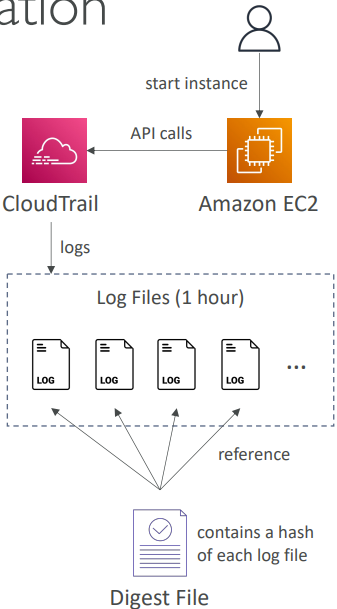

# AWS CloudTrail

CloudTrail is an AWS service that helps you enable governance, compliance, and operational and risk auditing of your AWS account. It records AWS API calls as events, providing a history of activity in your AWS account.

## Key Characteristics

- **Delivery Timing**: CloudTrail is not real-time
  - Events are delivered within 15 minutes of an API call
  - Log files are delivered to your S3 bucket every 5 minutes

## Log File Integrity Validation

CloudTrail provides a way to determine whether a log file was modified, deleted, or unchanged after CloudTrail delivered it.

### Digest Files

Digest files:
- Contain references to the log files for the last hour
- Include a hash of each log file for validation
- Are stored in the same S3 bucket as log files (but in a different folder)

### Enabling Log File Integrity Validation

You can enable validation through multiple methods:

#### AWS Console
- When creating or updating a trail, select **Yes** for the **Enable log file validation** option

#### AWS CLI
- To enable: Use the `--enable-log-file-validation` option with `create-trail` or `update-trail` commands
- To disable: Use the `--no-enable-log-file-validation` option

#### CloudTrail API
- Set the `EnableLogFileValidation` request parameter to `true` when calling `CreateTrail` or `UpdateTrail`

## Security Best Practices

### Protecting CloudTrail Logs

- **S3 Bucket Protection**:
  - Implement restrictive bucket policies
  - Enable versioning
  - Configure MFA Delete protection
  - Apply server-side encryption
  - Use S3 Object Lock for immutability

- **Access Control**:
  - Use IAM policies to restrict CloudTrail management
  - Implement least privilege access principles
