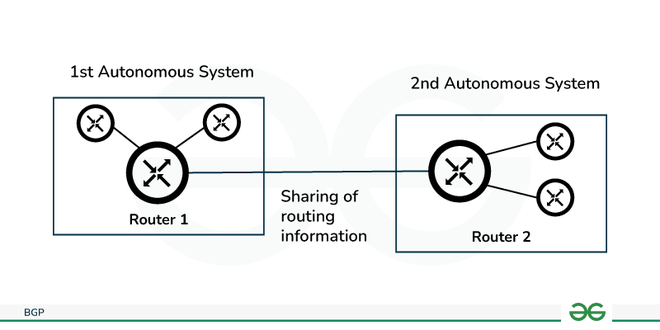
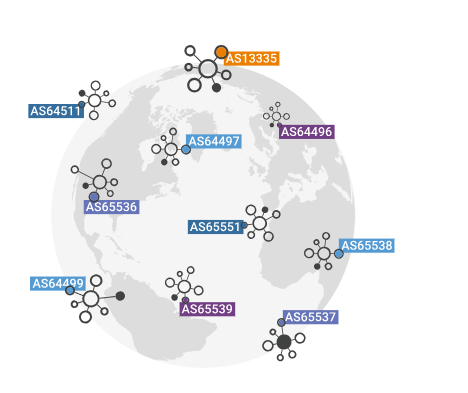

# AWS Site-to-Site VPN

## Terminology

### Border Gateway Protocol (BGP)

Border Gateway Protocol (BGP) refers to a gateway protocol that enables the internet to exchange routing information between autonomous systems (AS)

### Autonomous System and Autonomous System Number

An autonomous system (AS) is a large network or group of networks with a unified routing policy, forming a crucial part of the Internet's infrastructure.

- The Internet is essentially a network of networks, with autonomous systems being the major networks that constitute it.
- Every computer or device that connects to the Internet is linked to an AS.

An Autonomous System Number (ASN) is a unique identifier assigned to each autonomous system (AS) for use in Border Gateway Protocol (BGP) routing. It enables the AS to exchange routing information with other autonomous systems on the Internet.

- **Purpose**: ASNs are used to identify networks and facilitate the exchange of routing information between them.
- **Types**: There are two types of ASNs:
  - **Public ASNs**: Used for networks that connect to the global Internet.
  - **Private ASNs**: Used for internal networks that do not connect directly to the Internet.
- **Format**: ASNs can be in 16-bit or 32-bit formats, allowing for a large number of unique identifiers.

ASNs play a critical role in ensuring efficient and reliable routing of data across the Internet.

### Dead Peer Detection (DPD)

Dead Peer Detection (DPD) in Site-to-Site (S2S) VPN is a mechanism used to monitor the availability of the remote VPN peer and detect when it becomes unreachable.
