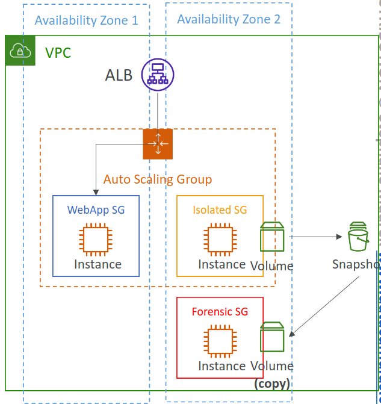
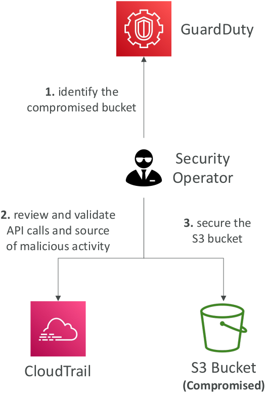

# Compromised resources

## Common steps

-   Identify compromised resources
-   Isolate resources
-   Trace the activity
-   Evaluate the affect

## EC2 instances

### Steps to address

-   Capture the instance's metadata
-   Enable Termination Protection
-   Isolate the instance (replace instance's SG - no outbound traffic allowed)
-   Detach the instance from any ASG (Suspend processes)
-   Deregister the instnace from any ELB
-   Snapshot the EBS volumes (deep analysis)
-   Tag the EC2 instance (to mark this instance is compromised)

### Investigation types

-   **Offline investigation**: shutdown instance and investigate with the EBS snapshot (by creating a new one from this EBS snapshot)
-   **Online investigation**: investigate the compromised instance

## S3 buckets

-   Identify bucket by **GuardDuty**
-   Identify source by **CloudTrail** or **Detective**
-   Recommended settings
    -   Block public access
    -   Bucket policies & User policies
    -   VPC endpoints
    -   Pre-signed URLs
    -   Access Points
    -   ACLs

## ECS

-   Identify the affected cluster by **GuardDuty**
-   Identity source of the malicious activity
-   Isolate the impacted tasks
-   Evaluate the presence of malicious activity
