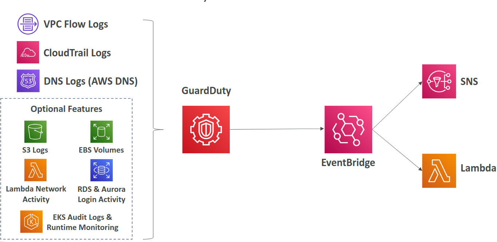

# GuardDuty

- Input data includes
  - CloudTrail events logs: management events and S3 data events
  - VPC Flow logs
  - DNS logs
  - Optional Features: EKS Audit logs, RDS, Audrora, EBS, Lambda,...
- Integrate EventBridge rules to be notified
- Can protect against **CryptoCurrency** attacks (has a dedicated "finding" for it)
