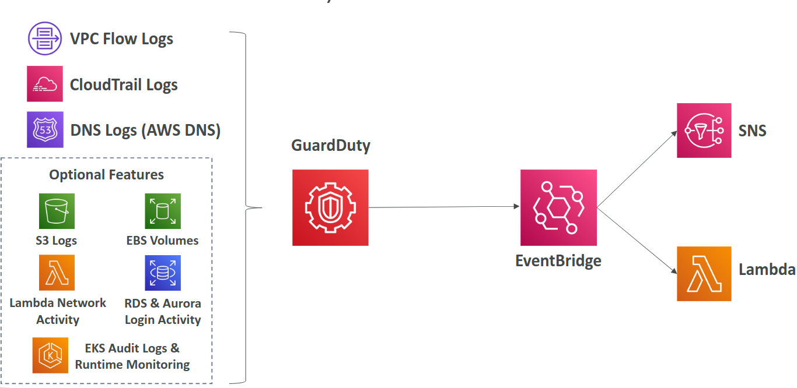
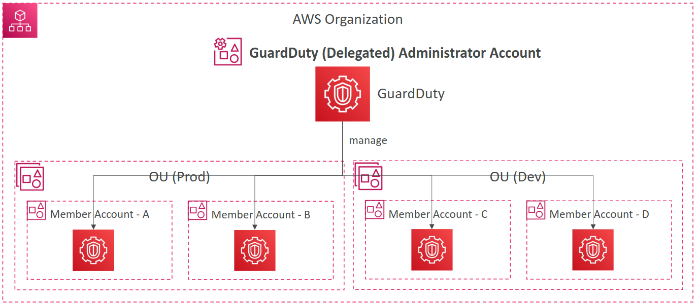
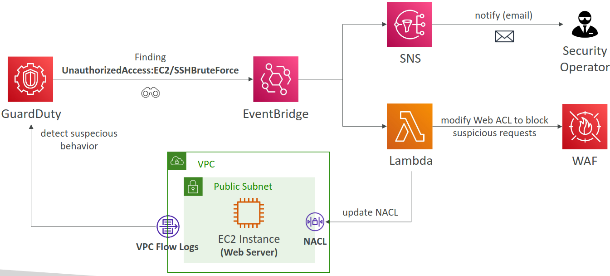
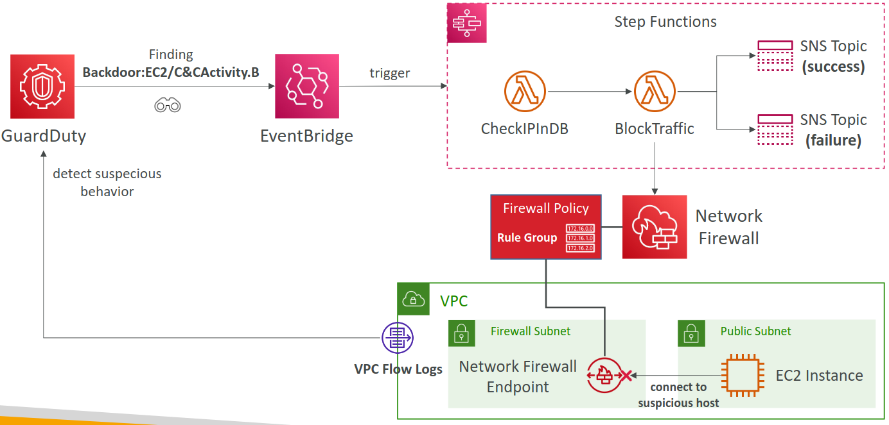

# GuardDuty

## Overview

- Input data includes
  - CloudTrail events logs: management events and S3 data events
  - VPC Flow logs
  - DNS logs
  - Optional Features: EKS Audit logs, RDS, Audrora, EBS, Lambda,...
- Integrate EventBridge rules to be notified
- Can protect against **CryptoCurrency** attacks (has a dedicated "finding" for it)

## Multi-account management

- Ability to manage multiple accounts in GuardDuty
- Associate the Member accounts with the Accounts Administrator by 2 ways
  - Through an AWS Organization
  - Sending invitation through GuardDuty
- Administrator account can
  - Add and remove member accounts
  - Manage GuardDuty within the Associated member accounts
  - Manage findings, suppression rules, trusted IP lists, thread lists
- Ability of specifying a member account as the Organization's delegated administrator of GuardDuty

## Some architectures

## Suppression Rules

- Set of criteria that automatically filter and archive new findings
- Example: low-value findings
- **Suppressed findings are NOT sent to Security Hub, S3, Detective, or EventBridge**
- Suppressed findings can be still viewed in the Archive

## Troubleshooting

### GuardDuty is activated but it didn’t generate any DNS based findings?

- **Reason**: GuardDuty only processes DNS logs if you use the default VPC DNS resolver. All other types of DNS resolvers won't generated DNS based findings
