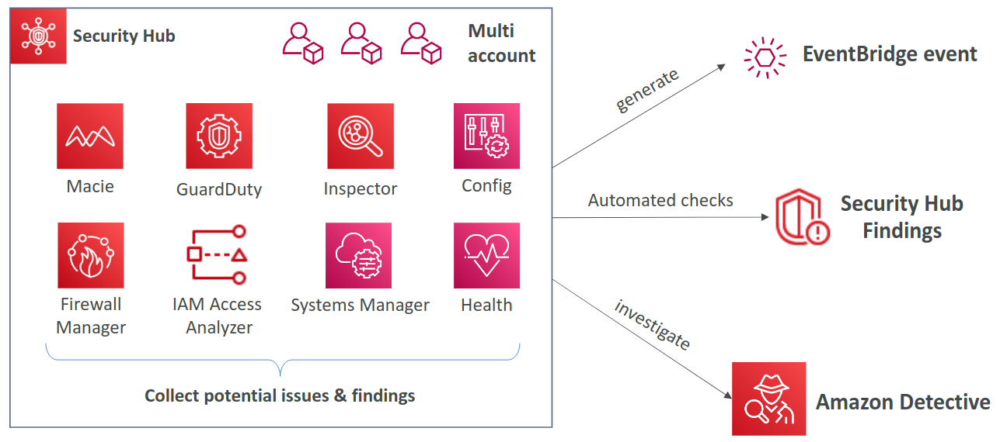
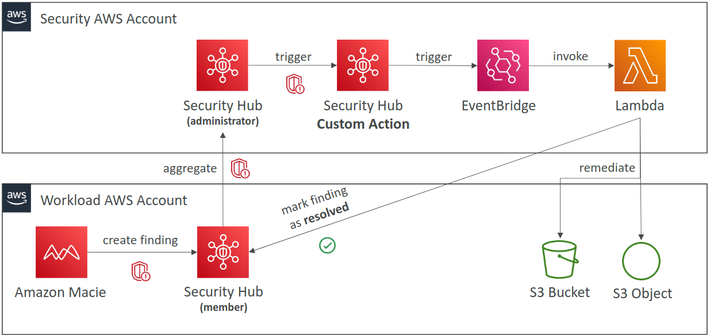
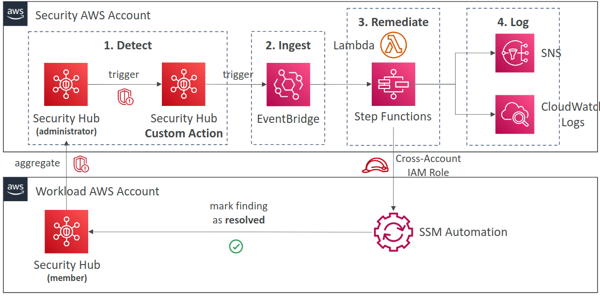

# Security Hub

## Prerequisites

- AWS Config must be enabled (for all accounts)

## 3rd party integrations

- Send findings to Security Hub: `3coresec`, `alerttopic`, `aqua`
- Receive findings from Security Hub: `atlassian`, `fireeye`, `fortinet`
- Update findings in Security Hub: `atlassian`, `servicenow`

## Findings

- Comsumes findings using **AWS Security Finding Format** (ASFF)
- Finding past 90 days are automatically deleted
- Filter by Region, integrations, Security Standard, Insights

## Custom actions

