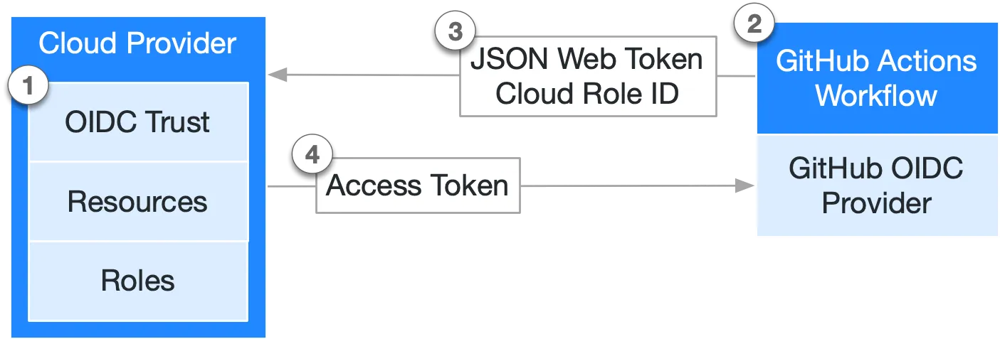
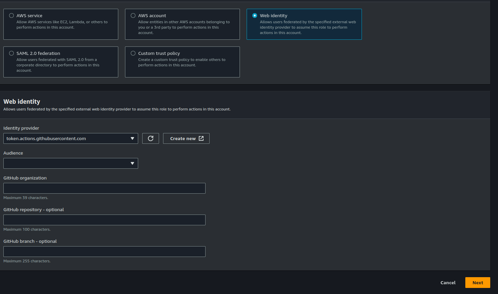

# Harden security by authenticating AWS in GitHub Action

## Native Approach

Authenticate with Access Key and Secret Key.

```yaml
- name: Configure AWS Credentials
  uses: aws-actions/configure-aws-credentials@v4
  with:
    aws-access-key-id: ${{ secrets.AWS_ACCESS_KEY_ID }}
    aws-secret-access-key: ${{ secrets.AWS_SECRET_ACCESS_KEY }}
    aws-region: us-east-2
```

Drawbacks:

- Require credentials which are saved in GitHub as secrets

## Better Solution with OIDC

### What is OIDC

Stands for OpenID Connect

### How does OIDC work



1. Create an OIDC trust between AWS and GitHub
2. Every time jobs run, GitHub’s OIDC Provider generates an OIDC token, append AWS information in the step or action, e.g the role or the region
3. Once AWS successfully validates, it provides a short-lived cloud access token that is available only for the duration of the job

### How to config OIDC

## Add the identity provider to AWS

To add the GitHub OIDC provider to IAM, see the [AWS documentation](https://docs.aws.amazon.com/IAM/latest/UserGuide/id_roles_providers_create_oidc.html).

- For the provider URL: Use `https://token.actions.githubusercontent.com`
- For the "Audience": Use `sts.amazonaws.com` if you are using the [official action](https://github.com/aws-actions/configure-aws-credentials).

## Create a role

### Trust policy



## Update the workflow file

```yaml
# Sample workflow to access AWS resources when workflow is tied to branch
# The workflow Creates static website using aws s3
name: AWS example workflow
on: push
env:
  BUCKET_NAME: "<example-bucket-name>"
  AWS_REGION: "<example-aws-region>"
# permission can be added at job level or workflow level
permissions:
  id-token: write # This is required for requesting the JWT
  contents: read # This is required for actions/checkout
jobs:
  S3PackageUpload:
    runs-on: ubuntu-latest
    steps:
      - name: Git clone the repository
        uses: actions/checkout@v4
      - name: configure aws credentials
        uses: aws-actions/configure-aws-credentials@v3
        with:
          role-to-assume: arn:aws:iam::1234567890:role/example-role
          role-session-name: samplerolesession
          aws-region: ${{ env.AWS_REGION }}
      # Upload a file to AWS s3
      - name: Copy index.html to s3
        run: |
          aws s3 cp ./index.html s3://${{ env.BUCKET_NAME }}/
```
