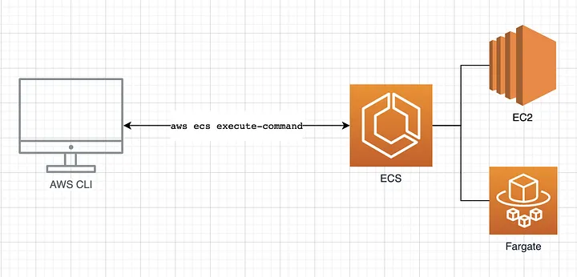

# 🖥️ Monitor Amazon ECS containers with ECS Exec



## 📝 Considerations

- ECS Exec Availability:
  - Not supported via AWS Management Console.
  - Supported for Linux containers on EC2, Fargate, and ECS Anywhere, and Windows containers on EC2 (specific ECS-optimized AMIs).
- ECS Exec and Amazon VPC:
  - If you are using interface VPC endpoint for ECS, it is required creating VPC endpoints for
    - Systems Manager Session Manager (ssmmessages)
    - AWS KMS if encryption is used.
  - For EC2 tasks using awsvpc networking mode without internet access, additional VPC endpoints are needed for System Manager Session Manager (ssmmessages).
- ECS Exec and SSM:
  - Commands run as root, and writable file systems are required.
  - Limiting ssm:start-session through IAM policies is recommended.
- Special Considerations:
  - Certain features, like Runtime Monitoring and Service Connect, run as sidecar containers.
  - ECS Exec uses CPU and memory resources, which must be accounted for in task definitions.
  - Only one ECS Exec session is allowed per PID namespace.
  - There is a 20-minute idle timeout for sessions, which cannot be changed.
  - ECS Exec can only be enabled for new tasks, not existing ones.
- Restrictions:
  - Not compatible with Microsoft Nano Server containers.
  - Cannot be used with tasks launched using asynchronous placement on clusters with managed scaling.

## 📋 Prerequisites

- Client side:
  - AWS CLI
  - Session Manager plugin
- Server side
  - Must use task role with appropriate permission for ECS service
  ```json
  {
    "Version": "2012-10-17",
    "Statement": [
      {
        "Effect": "Allow",
        "Action": ["ssmmessages:CreateControlChannel", "ssmmessages:CreateDataChannel", "ssmmessages:OpenControlChannel", "ssmmessages:OpenDataChannel"],
        "Resource": "*"
      },
      // (Optional) For auditing with CloudWatch Logs
      {
        "Effect": "Allow",
        "Action": ["logs:DescribeLogGroups"],
        "Resource": "*"
      },
      {
        "Effect": "Allow",
        "Action": ["logs:CreateLogStream", "logs:DescribeLogStreams", "logs:PutLogEvents"],
        "Resource": "arn:aws:logs:region:account-id:log-group:/aws/ecs/cloudwatch-log-group-name:*"
      },
      // (Optional) For auditing with S3
      {
        "Effect": "Allow",
        "Action": ["s3:GetBucketLocation"],
        "Resource": "*"
      },
      {
        "Effect": "Allow",
        "Action": ["s3:GetEncryptionConfiguration"],
        "Resource": "arn:aws:s3:::s3-bucket-name"
      },
      {
        "Effect": "Allow",
        "Action": ["s3:PutObject"],
        "Resource": "arn:aws:s3:::s3-bucket-name/*"
      },
      // (Optional) KMS
      {
        "Effect": "Allow",
        "Action": ["kms:Decrypt"],
        "Resource": "kms-key-arn"
      }
    ]
  }
  ```
  - ECS agent version:
    - `>= 1.50.2` if using ECS on EC2
    - `>= 1.4.0` if using ECS Fargate on Linux or `>= 1.0.0` on Windows

## 🚀 How to use

### 🔧 Configure Cluster

```bash
aws ecs create-cluster \
    --cluster-name cluster-name \
    --configuration executeCommandConfiguration="{ \
        kmsKeyId=string, \
        logging=OVERRIDE, \
        logConfiguration={ \
            cloudWatchLogGroupName=cloudwatch-log-group-name, \
            cloudWatchEncryptionEnabled=true, \
            s3BucketName=s3-bucket-name, \
            s3EncryptionEnabled=true, \
            s3KeyPrefix=demo \
        } \
    }"
```

### 🔄 Turning on ECS Exec for your tasks and services

```bash
aws ecs create-service \
    --cluster cluster-name \
    --task-definition task-definition-name \
    --enable-execute-command \
    --service-name service-name \
    --launch-type FARGATE \
     --network-configuration "awsvpcConfiguration={subnets=[subnet-12344321],securityGroups=[sg-12344321],assignPublicIp=ENABLED}" \
    --desired-count 1
```

After you turn on ECS Exec for a task, you can run the following command to confirm the task is ready to be used

```bash
aws ecs describe-tasks \
    --cluster cluster-name \
    --tasks task-id
```

The following output snippet is an example of what you might see.

```json
{
  "tasks": [
    {
      "containers": [
        {
          "managedAgents": [
            {
              "lastStartedAt": "2021-03-01T14:49:44.574000-06:00",
              "name": "ExecuteCommandAgent",
              "lastStatus": "RUNNING"
            }
          ]
        }
      ],
      "enableExecuteCommand": true
    }
  ]
}
```

### 🏃 Running commands using ECS Exec

```bash
aws ecs execute-command --cluster cluster-name \
    --task task-id \
    --container container-name \
    --interactive \
    --command "/bin/sh"
```

## 🎁 Bonus

### 🔒 Using IAM policies to limit access to ECS Exec

You limit user access to the execute-command API action by using one or more of the following IAM policy condition keys:

- `aws:ResourceTag/clusterTagKey`
- `ecs:ResourceTag/clusterTagKey`
- `aws:ResourceTag/taskTagKey`
- `ecs:ResourceTag/taskTagKey`
- `ecs:container-name`
- `ecs:cluster`
- `ecs:task`
- `ecs:enable-execute-command`

```json
{
  "Version": "2012-10-17",
  "Statement": [
    {
      "Effect": "Allow",
      "Action": ["ecs:ExecuteCommand", "ecs:DescribeTasks"],
      "Resource": ["arn:aws:ecs:region:aws-account-id:task/cluster-name/*", "arn:aws:ecs:region:aws-account-id:cluster/*"],
      "Condition": {
        "StringEquals": {
          "ecs:ResourceTag/environment": "development"
        }
      }
    }
  ]
}
```

With the following IAM policy, users can only launch tasks when ECS Exec is turned off.

```json
{
  "Version": "2012-10-17",
  "Statement": [
    {
      "Effect": "Allow",
      "Action": ["ecs:RunTask", "ecs:StartTask", "ecs:CreateService", "ecs:UpdateService"],
      "Resource": "*",
      "Condition": {
        "StringEquals": {
          "ecs:enable-execute-command": "false"
        }
      }
    }
  ]
}
```

### 🚫 Limiting access to the Start Session action

```json
{
  "Version": "2012-10-17",
  "Statement": [
    {
      "Effect": "Deny",
      "Action": "ssm:StartSession",
      "Resource": ["arn:aws:ecs:region:aws-account-id:task/cluster-name/*", "arn:aws:ecs:region:aws-account-id:cluster/*"]
    }
  ]
}
```

## 📚 References

- [Monitor Amazon ECS containers with ECS Exec](https://docs.aws.amazon.com/AmazonECS/latest/developerguide/ecs-exec.html)
