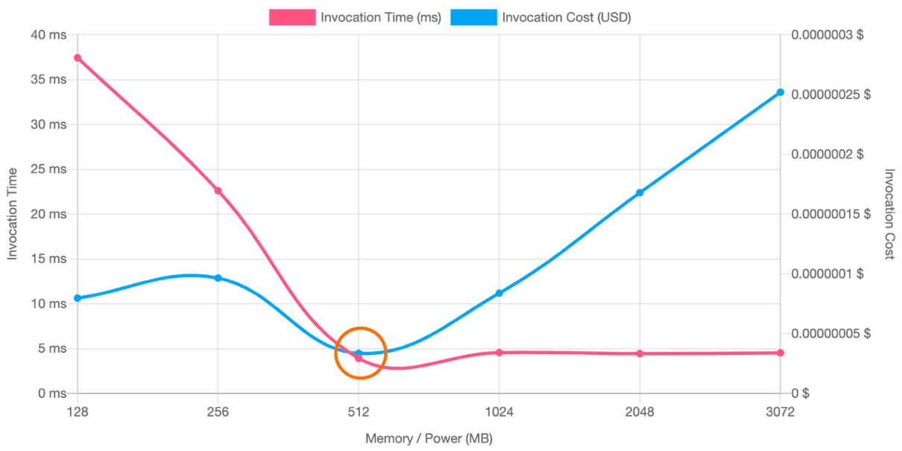

# Cost Optimization for Finops

## Compute

### EC2

#### Cost Optimization

- Rightsizing
- Elasticity: Create, launch and terminate server-instances as needed. Refer [Instance Scheduler on AWS](https://aws.amazon.com/solutions/implementations/instance-scheduler-on-aws/)
- EC2 Purchase options
- Modernization: resize to other instance types (like Graviton)

### Lambda

#### Pricing components

- Request
- Duration
- Additional charges: data transferred

#### Cost Optimization

- Memory: Can use [AWS Lambda Power Tunning tool](https://docs.aws.amazon.com/lambda/latest/operatorguide/profile-functions.html) and Cost Optimizer
- Use Graviton architecture
- Saving plans
- Code Efficiency: use [Amazon CodeGuru Profiler](https://aws.amazon.com/blogs/aws/find-your-most-expensive-lines-of-code-amazon-codeguru-is-now-generally-available/)

## Storage

### S3

#### Pricing components

- Storage
- Request & data retrievals
- Data transfer
- Management and Insights
- Replication

#### Cost optimization

- Intelligent tiering
- Lifecycle policies: for more predictable access patterns, we can move files to colder class
- Amazon S3 Storage lens

### EBS

#### Cost optimization

- Remove unattached volumes
- Snapshot cleanup: using Data Lifecycle Manager
- EBS Snapshot archive
- Rightsizing Over-provisioned Volumes
- Modernize Volumes: e.g move from gp2 to gp3 help improve performance and 20% lower price per GB

### EFS

#### Cost optimization

- Move files to colder class

## Database

### RDS

#### Pricing components

- Compute
- Storage
- Backups
- Data transfer

#### Cost optimization

- Underutilization
  - Leverage AWS Trusted Advisor Idle RDS instances to determine which instances can be stopped
  - [Instance Scheduler on AWS](https://aws.amazon.com/solutions/implementations/instance-scheduler-on-aws/) to start and stop automatically ECS and RDS
- Modernization
- Clean Backups

### Aurora

#### Pricing components

- Compute
- Storage
- I/O
- Backups
- Data transfer

#### Cost optimization

- Underutilization
- Aurora serverless
- Clean backups

### DynamoDB

#### Pricing components

- Read and write request
- Storage
- Global tables
- Data transfer

#### Cost optimization

- Capacity modes
- Table classes
- Backups
- Time to live

### ElastiCache

#### Pricing components

- Compute
- Backup
- Data transfer

#### Cost optimization

- Nodes
  - Graviton
  - Reserved instances
  - Data tiering: SSD
  - Autoscaling
- Backups
  - Retention days
  - Export backups to S3
- Serverless
