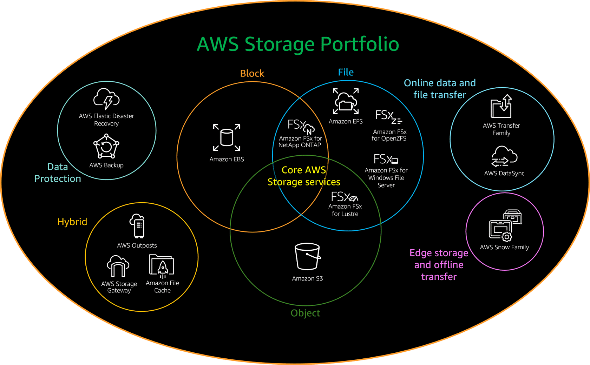

# Choose right storage solution

- Type of access method (block, file, or object)
- Patterns of access (random or sequential)
- Required throughput measured in megabits per second
- Required input output operations per second (IOPS)
- Frequency of access (online, offline, archival)
- Frequency of update [write once, read many (WORM); dynamic]
- Required access protocol
- How critical
- How sensitive
- How large
- How transient
- Budget to pay to store data
