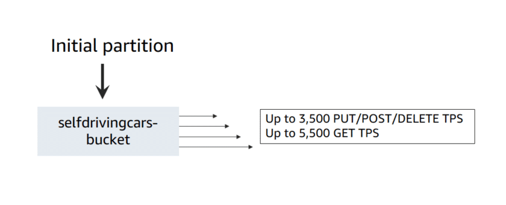

# Enhance Performance

## Using prefixes

Initially, objects keys in a bucket reside on a single partition.

Amazon S3 supports up to 3,500 PUT/POST/DELETE and 5,500 GET transactions per second (TPS) per partitioned prefix

## Parallelization

Amazon S3 doesn't have any limits for the number of connections made to your bucket.

An example: multipart uploads

When to use multipart uploads?

- Objects >= 100MB
- Maximize the available bandwidth when using over a stable high-bandwidth network
- Minimize impact of restarting a failed upload when using a spotty network

### Multipart Uploads

## AWS S3 Select

Amazon S3 Select is an Amazon S3 feature that allows you to retrieve specific data from the contents of an object using SQL expressions. By reducing the amount of data that Amazon S3 transfers, you minimize transfer costs and increase performance.

## Timeouts and retries

## Amazon Cloudfront

## Amazon S3 Transfer Acceleration

Transfer Acceleration enables fast, easy, and secure transfers of files over long distances between your client and an S3 bucket.

Transfer Acceleration takes advantage of CloudFront’s globally distributed edge locations

When to use Transfer Acceleration?

- Transfer gigabytes to terabytes of data across continents
- Upload to a centralized bucket from all over the world

**Noted**: If objects < 1GB, consider using CloudFront instead.

## Amazon CloudWatch

Monitor metrics to optimize
