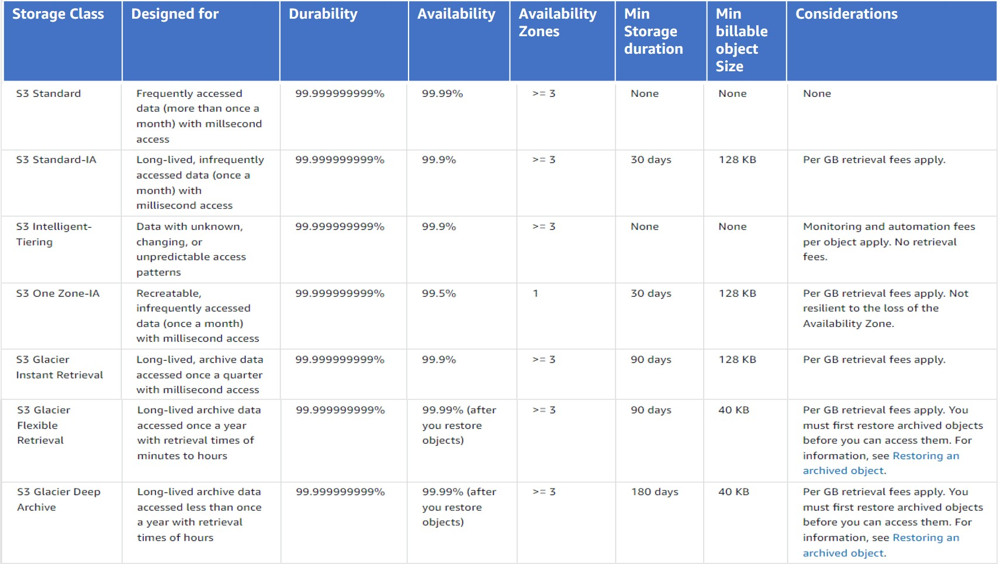

# Storage Classes

## Choose the right storage class

Should determine

- Access pattern
- SLAs
- Performance

## Storage Classes

- Standard-IA and Standard One zone IA are both suitable for objects larger than 128KB that are planned to store for at lest 30 days
