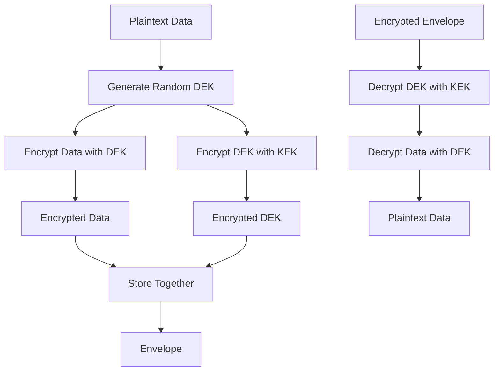

# Envelope Encryption

## Overview

Envelope encryption is a cryptographic technique that combines the efficiency of symmetric encryption with the security benefits of asymmetric encryption. It is widely used in cloud environments and key management systems to secure sensitive data efficiently.

## How It Works

1. **Data Encryption**: A random symmetric key (Data Encryption Key - DEK) is generated and used to encrypt the actual data
2. **Key Encryption**: The DEK is then encrypted using an asymmetric key (Key Encryption Key - KEK) or a master key
3. **Storage**: Both the encrypted data and the encrypted DEK (called the "envelope") are stored together
4. **Decryption**: To decrypt, the encrypted DEK is first decrypted using the KEK, then the DEK is used to decrypt the data

## Benefits

- **Performance**: Symmetric encryption is much faster for large data sets
- **Security**: Asymmetric encryption protects the DEK without exposing it
- **Key Management**: Simplifies key management by reducing the number of asymmetric operations
- **Scalability**: Allows for efficient encryption of large volumes of data

## Process Flow

## Common Use Cases

- Cloud storage services (AWS S3, Google Cloud Storage)
- Database encryption
- File encryption systems
- Messaging and communication protocols
- Backup and archival systems

## Key Terminology

- **DEK (Data Encryption Key)**: Symmetric key used to encrypt the actual data
- **KEK (Key Encryption Key)**: Asymmetric key used to encrypt the DEK
- **CMK (Customer Master Key)**: Master key used in key management systems
- **Envelope**: The package containing both encrypted data and encrypted DEK