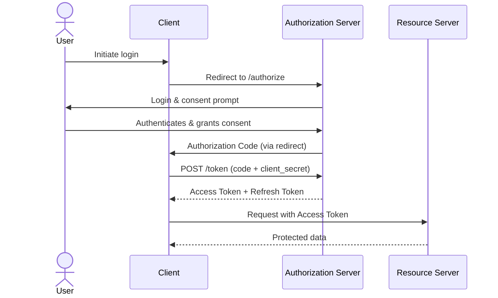
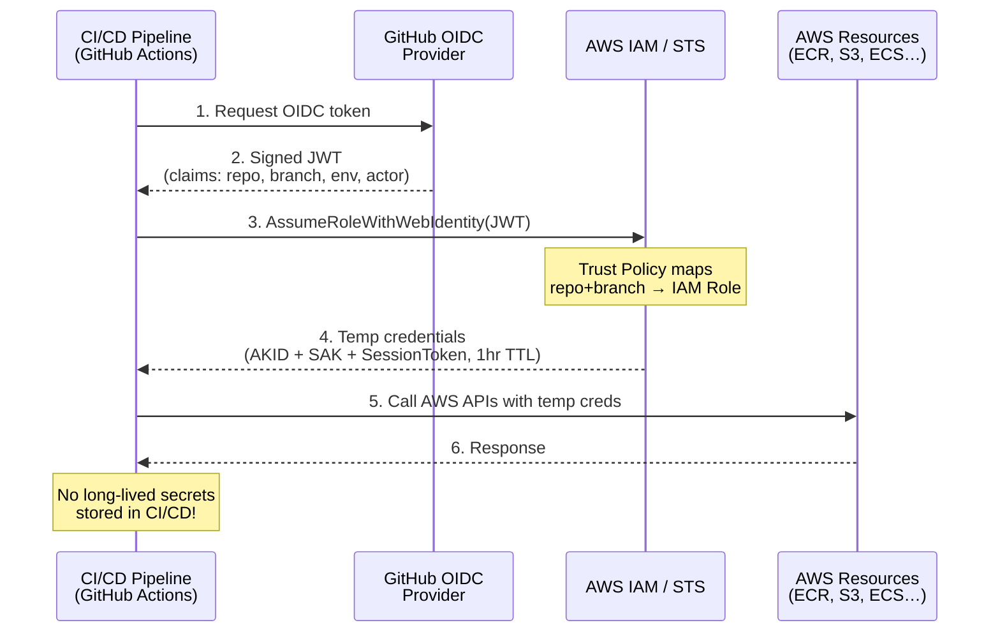

# OAuth

OAuth (Open Authorization) is an open standard for token-based authorization, allowing third-party services to access user resources without exposing credentials.

## Versions

| Version              | Status   | Notes                                                                   |
| -------------------- | -------- | ----------------------------------------------------------------------- |
| OAuth 1.0 (RFC 5849) | Obsolete | Required cryptographic signatures. Complex to implement.                |
| OAuth 2.0 (RFC 6749) | Current  | Simplified; relies on HTTPS. Token-based with bearer tokens.            |
| OAuth 2.1 (draft)    | Draft    | Consolidates best practices; removes implicit grant and password grant. |

## How OAuth 2.0 Works

### Core Roles

- **Resource Owner** — the user who owns the data
- **Client** — the application requesting access
- **Authorization Server** — issues tokens (e.g., Google, Auth0)
- **Resource Server** — hosts the protected data (API)

### Key Concepts

| Concept         | Role                                                                                                            | Visibility                    |
| --------------- | --------------------------------------------------------------------------------------------------------------- | ----------------------------- |
| **Client ID**   | Public identifier for the application, like a username for the app. Sent to the Authorization Server on every request (e.g., redirect to `/authorize`). | Public (visible in URLs)      |
| **Client Secret** | Confidential key shared only between the Client and the Authorization Server. Used during the token exchange (`POST /token`) to authenticate the Client — proves the request truly comes from the legitimate app, not an impersonator. | Secret (server-side only)     |
| **Audience**    | Identifies the **intended recipient** of the token. Typically a URI like `https://api.acme.com`. The Resource Server checks this claim and rejects tokens meant for another service. Prevents token reuse across unrelated APIs — a token issued for `orders-api` cannot be (mis)used against `payments-api`. | Embedded in the token (claim) |
| **Scope**       | A space-separated list of **permissions** the Client is requesting (e.g., `openid profile email`). The Authorization Server presents these as granular consent items to the user. The resulting token is scoped to only what was granted — principle of least privilege. | Sent in request; enforced at token issuance |
| **Redirect URI** | The URL the Authorization Server sends the user back to after login/consent. Must be **pre-registered** and **exactly matched** (no open redirects). Prevents an attacker from hijacking the authorization code by swapping in their own malicious callback. | Sent in request; validated server-side |

### Flow (Authorization Code Grant — most common)



> **Consent (prompt):** The screen where the Authorization Server asks the user to grant the Client specific permissions (scopes) — e.g., "App X wants to read your email." The user approves or denies. This ensures the user knowingly delegates access without sharing their password.

### Token Types

- **Access Token** — short-lived (minutes to hours); used to access resources
- **Refresh Token** — long-lived (days to weeks); used to get new access tokens
- **ID Token** (OpenID Connect) — JWT with user identity claims; for authentication, not authorization

### Grant Types in OAuth 2.0

| Grant                     | Use Case                       | Secure?                    |
| ------------------------- | ------------------------------ | -------------------------- |
| Authorization Code + PKCE | SPAs, mobile, server-side apps | ✅ Recommended             |
| Client Credentials        | Machine-to-machine             | ✅ (no user involved)      |
| Implicit (deprecated)     | Legacy SPAs                    | ❌ Token exposed in URL    |
| Password (deprecated)     | Legacy first-party apps        | ❌ Client sees credentials |

### Key Security Considerations

- Always use PKCE for public clients
- Store tokens securely (never in localStorage for SPAs)
- Validate `redirect_uri` server-side
- Use short-lived access tokens and rotate refresh tokens
- Scope tokens to minimum required permissions

## SSO, OIDC, and Real-World Use Cases

### How They Relate

```
OAuth 2.0 (Authorization — "what can this client access?")
    └── OIDC (Authentication — "who is this user?" — adds ID Token + UserInfo)
            └── SSO (User experience — "log in once, use many apps" — implemented via OIDC or SAML)
```

### OpenID Connect (OIDC)

A thin **authentication layer on top of OAuth 2.0**. Reuses the same flows (authorization code, PKCE, etc.) and adds:

| Addition              | Purpose                                                                                                                              |
| --------------------- | ------------------------------------------------------------------------------------------------------------------------------------ |
| **ID Token**          | JWT signed by the Authorization Server with user identity claims (`sub`, `name`, `email`, `iss`, `aud`). Client uses it to establish a local session. |
| **UserInfo Endpoint** | A standard `GET /userinfo` API returning extended claims (profile picture, address, etc.) when given a valid Access Token.           |
| **`openid` scope**    | Signals the Authorization Server that the Client wants identity on top of authorization. Without this scope, only an Access Token is returned — no ID Token. |

Every OIDC flow is also an OAuth 2.0 flow: you always get both an Access Token (authorization) and an ID Token (authentication). OIDC standardizes how identity claims are structured (JWT), signed (JWK/JWKS), and delivered, so any provider (Google, Auth0, Okta, Azure AD) works with any OIDC-compliant library.

### Single Sign-On (SSO)

SSO is a **user-experience concept**, not a protocol: log in once, access many applications without re-entering credentials.

| Implementation | Role                                                                                                                       | Status               |
| -------------- | -------------------------------------------------------------------------------------------------------------------------- | -------------------- |
| **OIDC**       | User authenticates at the IdP → gets an ID Token → each app validates the same token (or a derived session).               | ✅ Preferred for new apps |
| **SAML**       | Older XML-based standard for exchanging authentication data. Common in enterprise (Active Directory, legacy SaaS).         | Legacy, still widespread |

A typical OIDC-based SSO flow: user logs in at the IdP → gets an ID Token + session cookie → other apps redirect to the same IdP → the IdP sees the existing session and silently issues a new ID Token without re-prompting.

### Real-World Use Cases

| Scenario                             | Protocol                | Flow / Grant                        | What Happens                                                                                                                                                                                                                             |
| ------------------------------------ | ----------------------- | ----------------------------------- | ---------------------------------------------------------------------------------------------------------------------------------------------------------------------------------------------------------------------------------------- |
| **"Log in with Google"** (social login) | OIDC (on OAuth 2.0)    | Authorization Code + PKCE           | User clicks "Log in with Google" → redirected to Google's `/authorize` with `scope=openid profile email` → Google authenticates user and returns an ID Token with user identity → your app uses claims to create/update a local user. |
| **Enterprise SSO** (Okta / Azure AD) | OIDC or SAML            | Authorization Code + PKCE (OIDC)    | Employee logs into the company portal once → clicks into Jira, Confluence, Slack — each trusts the same IdP, receives an ID Token, and skips the login screen. Tokens carry group/role claims that each app maps to internal permissions.  |
| **CI/CD pipeline calling cloud APIs**| OAuth 2.0               | Client Credentials                  | GitHub Actions runner picks up `CLIENT_ID` + `CLIENT_SECRET` from secrets → calls IdP's `/token` endpoint → receives an Access Token scoped to the cloud resources needed (e.g., push to ECR, deploy to ECS). No user involved.       |
| **Mobile app + backend API**         | OIDC (on OAuth 2.0)     | Authorization Code + PKCE           | Mobile app opens a browser tab to the IdP for login (no embedded WebView) → PKCE protects the code exchange since the mobile app cannot keep a Client Secret → gets Access Token (for API calls) + ID Token (for display name/avatar). |
| **Microservice-to-microservice**     | OAuth 2.0               | Client Credentials                  | Service A needs to call Service B → authenticates with its own Client ID + Secret → gets an Access Token with audience `service-b` → Service B validates audience and scopes and serves the request. No user context needed.            |
| **IoT device reporting telemetry**   | OAuth 2.0               | Device Code Grant                   | Constrained device (no browser, no keyboard) displays a short code + URL → user visits the URL on their phone, enters the code, and authorizes the device → device polls the IdP for tokens. Device never sees user credentials.        |

## Diagrammed Examples

### OIDC on CI/CD Pipeline

OIDC eliminates static cloud credentials from CI/CD by exchanging a short-lived identity token for temporary cloud credentials. The pipeline never stores long-lived secrets.



> **Key insight:** The pipeline never touches a `CLIENT_ID` or `CLIENT_SECRET`. GitHub Actions injects a JWT via `ACTIONS_ID_TOKEN_REQUEST_URL`, and `configure-aws-credentials` handles the STS exchange automatically. The IAM Role's trust policy decides which repos get which permissions — no secret rotation needed.
>
> **Why OIDC?** No static credentials in repo secrets. Tokens are short-lived (~1 hour), bound to a specific repo/branch/environment via JWT claims. AWS validates the signature against GitHub's JWKS endpoint.

### OAuth 2.0 for Jira MCP

An MCP server uses the OAuth 2.0 Authorization Code grant to call the Jira REST API on behalf of a user.

```mermaid
sequenceDiagram
    actor User
    participant Client as MCP Client<br/>(Claude Desktop)
    participant Server as MCP Server
    participant Atlassian as Atlassian<br/>(Auth + Token)
    participant Jira as Jira REST API

    %% Phase 1: Initiation
    User->>Client: 1. "List my Jira issues"
    Client->>Server: 2. tools/list → jira tool available
    Client->>Server: 3. tools/call → jira_search_issues

    %% Phase 2: Authorization Code flow
    Server->>Atlassian: 4. Redirect to /authorize<br/>(client_id, scope, redirect_uri)
    Atlassian->>User: 5. Login & consent prompt
    User->>Atlassian: 6. Authenticate + approve scopes
    Atlassian-->>Server: 7. Authorization Code<br/>(via redirect_uri)

    %% Phase 3: Token exchange
    Server->>Atlassian: 8. POST /token<br/>(code + client_id + client_secret)
    Atlassian-->>Server: 9. Access Token + Refresh Token
    Note over Server: Store tokens securely<br/>(env var / encrypted file)

    %% Phase 4: Use the API
    Server->>Jira: 10. GET /rest/api/3/search<br/>Authorization: Bearer &lt;access_token&gt;
    Jira-->>Server: 11. Issues JSON
    Server-->>Client: 12. Tool result (issues list)
    Client-->>User: 13. Display issues

    %% Phase 5: Token refresh
    Note over Server,Atlassian: ⏰ Access token expired (1 hour)
    Server->>Atlassian: 14. POST /token<br/>(grant_type=refresh_token)
    Atlassian-->>Server: 15. New Access Token + Refresh Token
```

> **Key insight:** This is **3-legged OAuth (3LO)** — the user is present and must grant consent through a browser. Contrast with the OIDC pipeline example above, which is machine-to-machine with no user. The MCP server holds a refresh token and silently renews the access token as long as the user's consent remains valid.
>
> **Setup:** MCP Server acts as the OAuth Client — registered at `developer.atlassian.com`. Scopes like `read:jira-work`, `write:jira-work` control API access. Token TTL is 1 hour; refresh before expiry.
