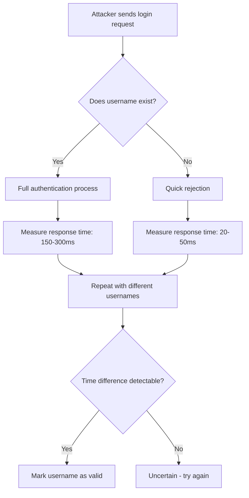

# Timing-Based User Enumeration Attacks

Timing-based user enumeration is a technique that exploits subtle differences in response times to determine whether a username exists in a system. Unlike traditional enumeration methods that check for error messages, this attack measures the time it takes for the server to respond, revealing user existence through algorithmic differences.

## How It Works

When authentication systems process login attempts, they often perform different operations based on whether the user exists:

1. **User exists**: System looks up credentials, verifies password, checks account status
2. **User doesn't exist**: System may return immediately or skip certain validation steps

The time difference between these scenarios can be measured to infer username validity.

## Attack Flow



## Common Vulnerability Points

- **Login forms**: Different processing paths for existing vs. non-existing users
- **Password reset**: Email sending time varies based on user existence
- **Account creation**: Instant rejection vs. checking for duplicates
- **API endpoints**: Response times differ for valid/invalid usernames

## Timing Analysis Example

```javascript
// Vulnerable authentication endpoint
async function authenticate(username, password) {
  const user = await db.findUser(username); // Fast query

  if (!user) {
    return { error: "Invalid credentials", timing: 25 }; // Quick rejection
  }

  // Additional validation for existing users
  const passwordValid = await bcrypt.compare(password, user.password);
  const accountActive = await checkAccountStatus(user.id);
  const rateLimitCheck = await checkRateLimit(user.id);

  return {
    success: true,
    timing: 180, // Much longer due to multiple operations
  };
}
```

**Attackers measure response times and identify valid usernames where timing consistently exceeds baseline.**

## Impact

- **Information disclosure**: Attackers discover valid usernames
- **Targeted attacks**: Enables focused brute-force and credential stuffing
- **Reconnaissance**: Supports social engineering campaigns
- **Account enumeration**: Validates existing accounts for further exploitation

## Mitigation Strategies

### 1. Constant-Time Authentication

```javascript
// Constant-time comparison to eliminate timing differences
async function authenticate(username, password) {
  // Always perform the same operations regardless of user existence
  const user = (await db.findUser(username)) || null;
  const providedPassword = password || "";

  // Use constant-time comparison
  const userPassword = user ? user.password : generateFakePassword();
  const timing = await constantTimeCompare(providedPassword, userPassword);

  // Introduce artificial delay to mask timing variations
  await sleep(CONFIG.AUTHENTICATION_DELAY);

  return timing ? { success: true } : { error: "Invalid credentials" };
}
```

### 2. Consistent Response Times

- Add artificial delays to ensure all responses take the same amount of time
- Use fixed-time algorithms for all authentication operations
- Implement consistent error messages with uniform response times

### 3. Rate Limiting and Account Lockout

```javascript
const rateLimiter = new RateLimiter({
  windowMs: 15 * 60 * 1000, // 15 minutes
  max: 5, // 5 attempts per window
  message: "Too many attempts, please try again later",
});

app.post("/login", rateLimiter, authenticate);
```

### 4. Monitoring and Alerting

- Monitor authentication endpoints for unusual timing patterns
- Alert on rapid sequential login attempts from single IPs
- Log timing anomalies for security analysis

## Detection Indicators

- Multiple requests with different usernames but identical passwords
- Consistent timing patterns suggesting systematic enumeration
- High volume of failed authentications with varying usernames
- Requests originating from suspicious IP addresses or user agents

## Testing for Vulnerability

Use timing analysis to identify vulnerability:

```bash
# Measure response times for existing vs. non-existing users
time curl -X POST https://example.com/login \
  -d "username=admin&password=test"

time curl -X POST https://example.com/login \
  -d "username=admin123&password=test"

# Compare the response times
```

Compare response times across multiple requests with the same username to establish a baseline, then test with different usernames to identify valid accounts.

## Security Best Practices

1. **Never reveal username existence** in any error message or response
2. **Use constant-time algorithms** for all authentication comparisons
3. **Implement consistent processing** regardless of user validity
4. **Add random delays** to mask timing differences
5. **Monitor for enumeration patterns** and block suspicious activity
6. **ConsiderCAPTCHA** for repeated authentication attempts
7. **Use generic error messages** that don't differentiate between invalid username and password
